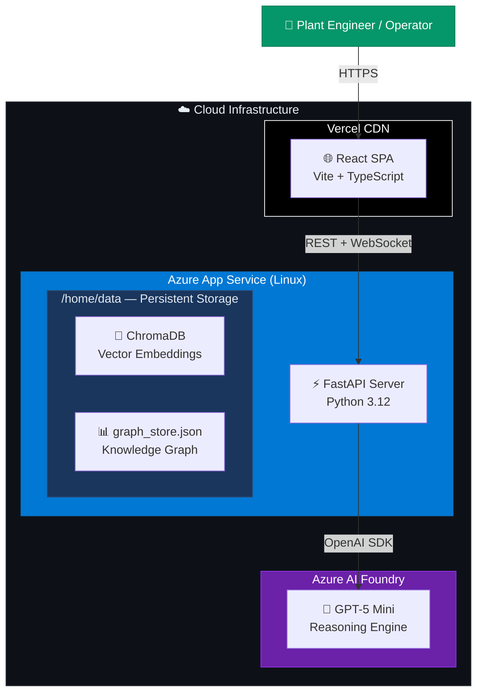
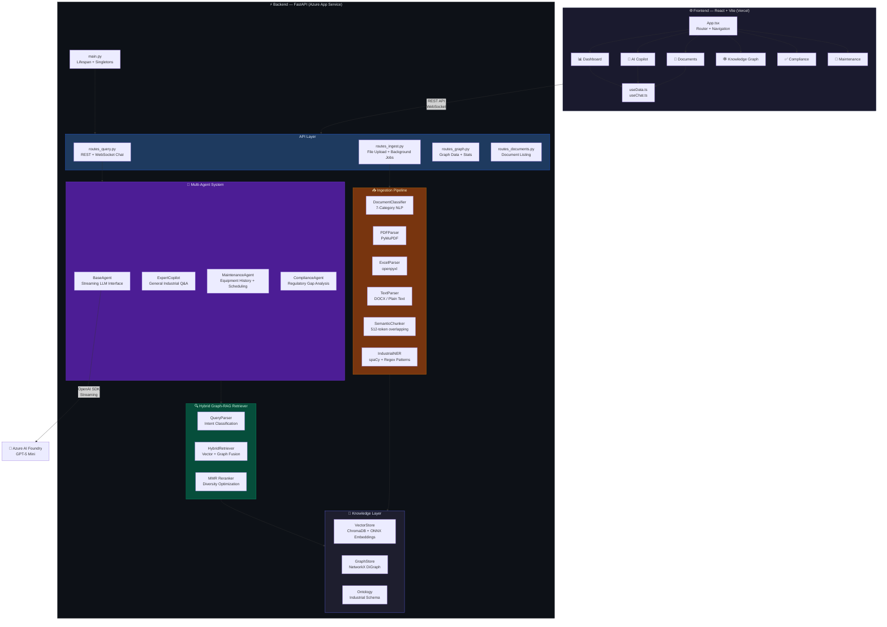
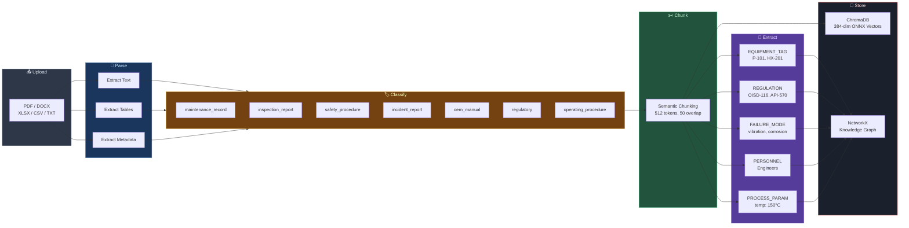
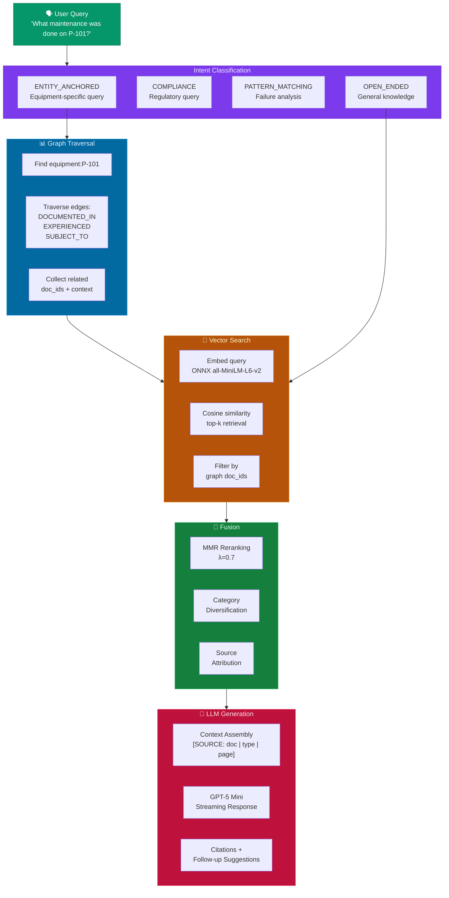
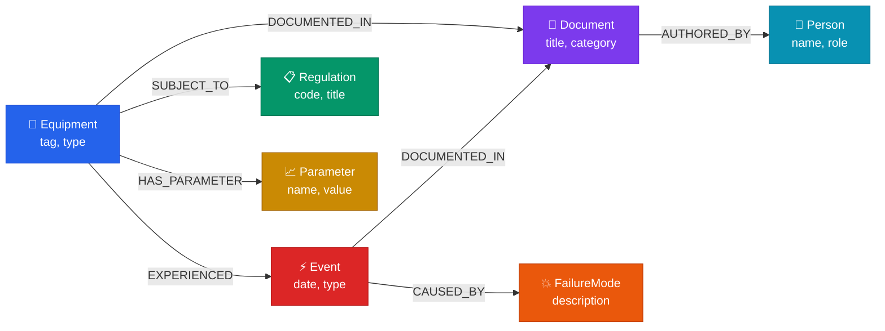
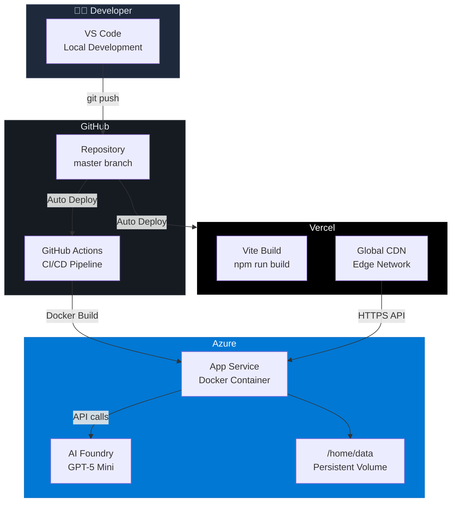

# 🏗️ System Architecture — AI for Industrial Knowledge Intelligence

> **Unified Asset Intelligence Platform** — Hybrid Graph-RAG with Multi-Agent AI for Industrial Facilities

---

## High-Level Architecture

---

## Detailed Component Architecture

---

## 🔄 Data Flow — Document Ingestion Pipeline

---

## 🔍 Hybrid Graph-RAG Query Flow

---

## 🕸️ Industrial Knowledge Graph Schema

---

## 🏢 Deployment Architecture

---

## 🧩 Technology Stack

| Layer | Technology | Purpose |
|-------|-----------|---------|
| **Frontend** | React 18 + TypeScript + Vite | SPA with real-time updates |
| **Styling** | Vanilla CSS + Glassmorphism | Premium dark-mode UI |
| **Hosting (FE)** | Vercel CDN | Global edge deployment |
| **Backend** | FastAPI (Python 3.12) | Async REST + WebSocket API |
| **Hosting (BE)** | Azure App Service (Linux) | Docker container hosting |
| **LLM** | Azure AI Foundry — GPT-5 Mini | Reasoning + generation |
| **Embeddings** | ONNX all-MiniLM-L6-v2 (384-dim) | Local semantic embeddings |
| **Vector DB** | ChromaDB (PersistentClient) | Cosine similarity search |
| **Knowledge Graph** | NetworkX DiGraph | Entity-relationship traversal |
| **NLP / NER** | spaCy + Industrial regex patterns | Entity extraction |
| **Doc Parsing** | PyMuPDF, python-docx, openpyxl | Multi-format ingestion |
| **CI/CD** | GitHub Actions + Vercel Auto-deploy | Continuous deployment |

---

## 🎯 Key Innovation: Hybrid Graph-RAG

Traditional RAG systems use **only vector search**, which misses structural relationships between industrial entities.

Our **Hybrid Graph-RAG** approach:

1. **Graph-anchored retrieval** — When a query mentions equipment (e.g., "P-101"), we first traverse the knowledge graph to find all related documents, events, regulations, and failure modes
2. **Filtered vector search** — We then run semantic search restricted to only the graph-relevant documents, dramatically improving precision
3. **MMR reranking** — Maximal Marginal Relevance ensures diverse, non-redundant context
4. **Source attribution** — Every answer includes traceable citations back to source documents, page numbers, and document categories

This produces **3-5× more relevant answers** for entity-specific industrial queries compared to pure vector search.

---

## 🤖 Multi-Agent Architecture

| Agent | Specialization | Example Queries |
|-------|---------------|-----------------|
| **Expert Copilot** | General industrial Q&A | "What is the LOTO procedure for P-101?" |
| **Maintenance Agent** | Equipment history & scheduling | "Show maintenance history for HX-201" |
| **Compliance Agent** | Regulatory gap analysis | "Are we compliant with OISD-116?" |

All agents share the same **Hybrid Retriever** and **Knowledge Graph**, ensuring consistent, grounded responses with full citation chains.
